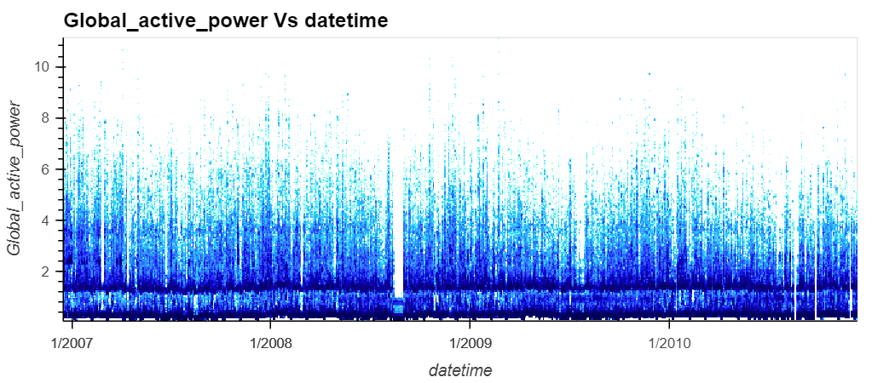

```{r setup, include=FALSE}
knitr::opts_chunk$set(echo = TRUE)
```



This plot above shows the electric power consumption, Global_active_power, in one household taken every minute for almost 4 years. 


This plot above shows the total daily electric consumption in one household for almost 4 years. 
